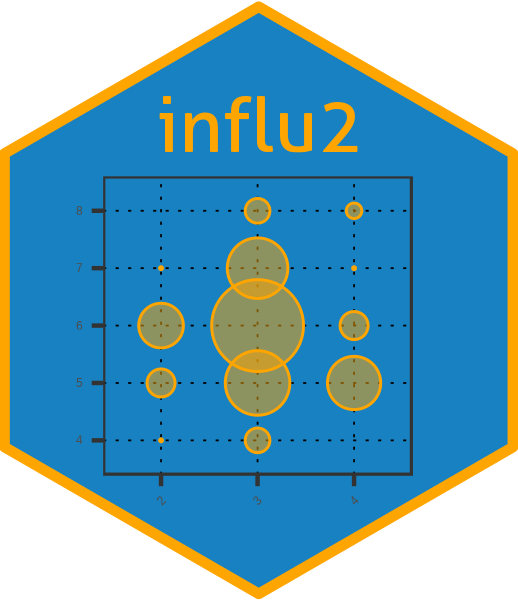

# influ2 

Nokome Bentley's R package `influ` was developed for use with frequentist models fitted in R using the `glm` function. The `infu2` package is the Bayesian couterpart and has been developed for use with `brms`. It works with population-level or group-level effects, the Bayesian equivalents of fixed-effects and random-effects. It contains functions for extracting coefficients, calculating the influence of terms, generating CDI plots, step plots, and other diagnostic plots.
